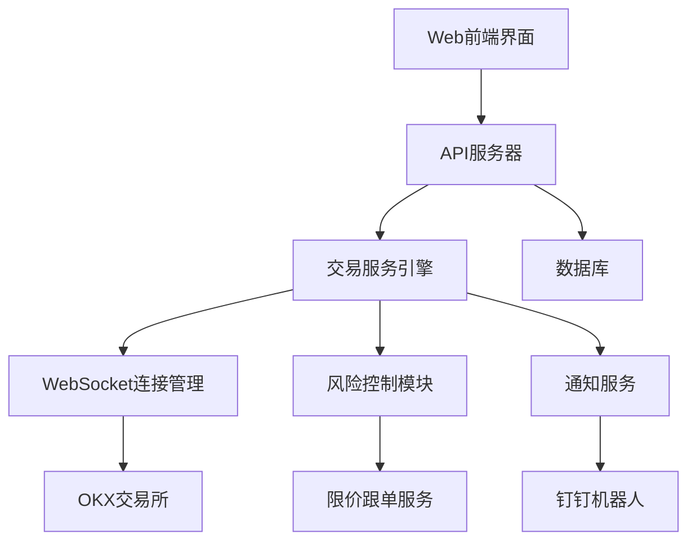
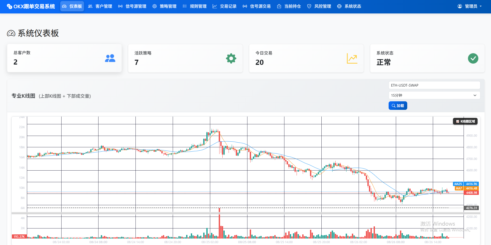
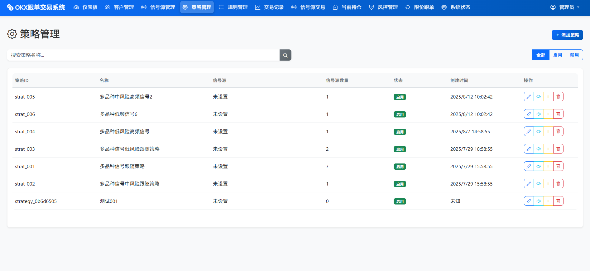
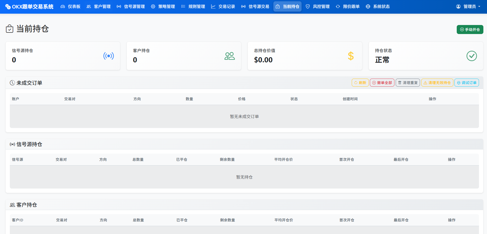
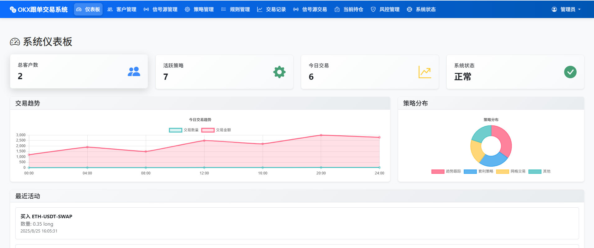
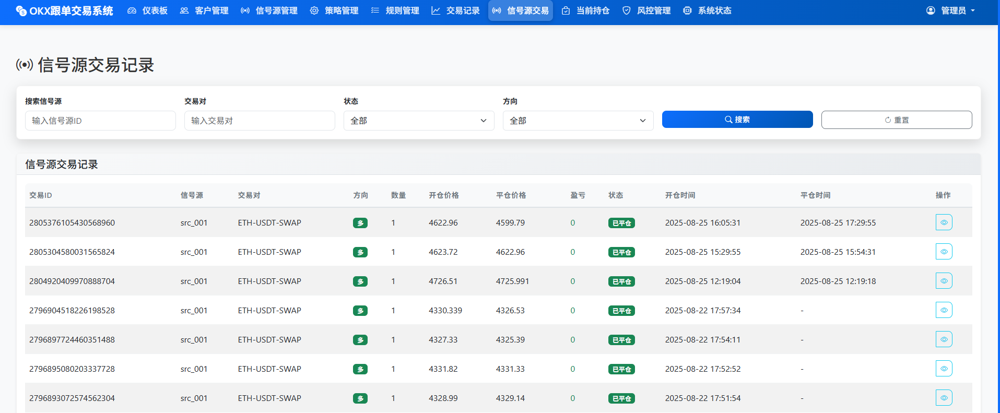
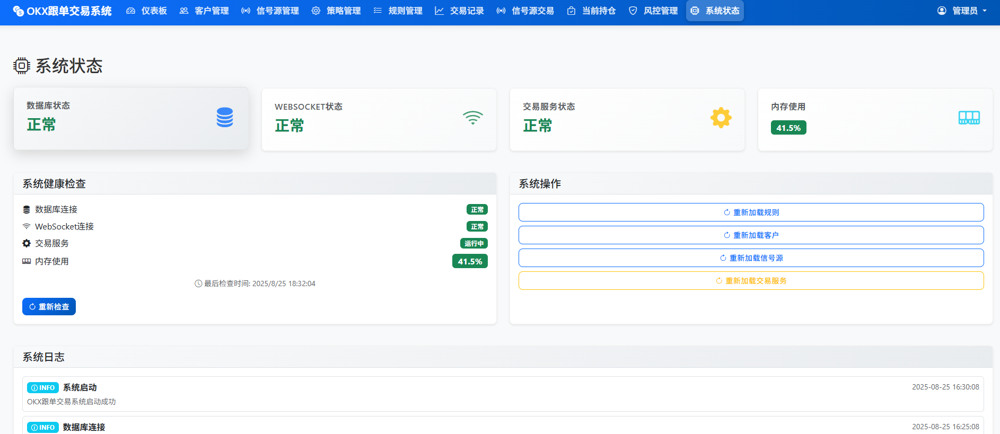

<div align="center">

# 🚀 企业级加密货币交易系统

[](https://opensource.org/licenses/MIT)
[](https://www.python.org/)
[](https://getbootstrap.com/)
[](https://github.com/hall130/crypto_trade_for_public)

**专业的加密货币交易所自动跟单解决方案，支持OKX等主流交易所**

[📖 查看文档](#-文档目录) • [🚀 快速开始](#-快速开始) • [💡 功能特性](#-功能特性) • [📊 界面预览](#-界面预览) • [📞 技术支持](#-技术支持)

---

**语言版本**: 🇨🇳 中文 | [🇺🇸 English](./README_EN.md)

---

## 📋 目录索引

- [🎯 项目简介](#-项目简介) - 系统概览和核心亮点
- [🏗️ 系统架构](#️-系统架构) - 技术架构图和设计理念  
- [💡 功能特性](#-功能特性) - 详细功能模块说明
- [🚀 快速开始](#-快速开始) - 安装部署和配置指南
- [📊 界面预览](#-界面预览) - 系统界面截图展示
- [📖 文档目录](#-文档目录) - 完整文档导航
- [🔧 使用示例](#-使用示例) - 配置和使用示例
- [🛡️ 安全特性](#️-安全特性) - 安全机制说明
- [📈 性能指标](#-性能指标) - 系统性能数据
- [🌟 项目特色](#-项目特色) - 选择理由和适用场景
- [📞 技术支持](#-技术支持) - 获取帮助和支持渠道

</div>

---

## 🎯 项目简介

这是一个专业的加密货币交易所自动跟单系统，采用现代化的技术架构，为用户提供安全、高效、易用的跟单交易解决方案。系统支持多账户管理、实时监控、风险控制等核心功能，适合个人交易者和专业机构使用。

### ✨ 核心亮点

- 🎯 **智能跟单**: 支持多个客户账户跟随信号源自动交易
- 🛡️ **风险控制**: 内置杠杆控制、仓位管理、止损机制
- 📊 **实时监控**: WebSocket实时连接监控、系统健康检查
- 🌐 **Web管理**: 现代化的Web管理界面，支持移动端
- 🔔 **智能通知**: 钉钉机器人通知，及时了解交易状态
- ⚡ **高性能**: 优化的架构设计，支持大量并发交易

## 🏗️ 系统架构



### 技术架构特点

- **前后端分离**: 现代化的前后端分离架构
- **微服务设计**: 模块化的服务设计，易于扩展
- **实时通信**: WebSocket确保数据实时同步
- **数据持久化**: MySQL数据库保证数据安全
- **容错机制**: 完善的错误处理和自动恢复

## 💡 功能特性

### 🎯 核心交易功能

| 功能模块 | 描述 | 状态 |
|---------|------|------|
| 🔄 自动跟单 | 支持多客户跟随信号源自动开仓/平仓 | ✅ 完成 |
| 💰 限价跟单 | 按折扣价格跟随信号源开仓 | ✅ 完成 |
| 🛡️ 风险控制 | 杠杆控制、仓位管理、止损机制 | ✅ 完成 |
| 📊 仓位同步 | 自动检测和补全因断连丢失的仓位 | ✅ 完成 |
| ⚙️ 策略管理 | 灵活的策略配置和规则管理 | ✅ 完成 |

### 📱 管理界面功能

| 界面模块 | 功能描述 | 技术栈 |
|---------|---------|--------|
| 🏠 仪表盘 | 实时统计、图表可视化、系统监控 | Chart.js, Bootstrap |
| 👥 客户管理 | 账户信息管理、资产监控 | HTML5, CSS3 |
| 📡 信号源管理 | 信号源配置、状态监控 | JavaScript ES6+ |
| 📈 交易记录 | 历史记录查询、数据分析 | 响应式设计 |
| ⚙️ 系统设置 | 参数配置、维护工具 | RESTful API |

### 🔧 高级功能

- **连接管理**: 统一的WebSocket连接管理器
- **异常处理**: 完善的错误处理和自动恢复机制
- **性能监控**: 内存使用、数据库连接、任务健康监控
- **日志系统**: 详细的操作日志和错误日志记录
- **数据备份**: 自动数据备份和恢复机制

## 🚀 快速开始

### 环境要求

- **Python**: 3.8+
- **数据库**: MySQL 5.7+
- **操作系统**: Windows/Linux/macOS
- **浏览器**: Chrome 80+, Firefox 75+, Safari 13+

### 安装步骤

```bash
# 1. 克隆项目（需要获取完整代码）
git clone <private-repository>
cd crypto-trading-system

# 2. 安装依赖
pip install -r requirements.txt

# 3. 配置数据库
mysql -u root -p
CREATE DATABASE trade_db CHARACTER SET utf8mb4;
SOURCE trade_db.sql;

# 4. 配置系统
cp config_example.py config.py
# 编辑 config.py 文件设置数据库和API密钥

# 5. 启动系统
python main.py
```

### 快速配置

```python
# config.py 配置示例
MYSQL_CONFIG = {
    'host': 'localhost',
    'user': 'your_username',
    'password': 'your_password',
    'db': 'trade_db',
    'port': 3306
}

# OKX API配置
OKX_CONFIG = {
    'api_key': 'your_api_key',
    'secret_key': 'your_secret_key',
    'passphrase': 'your_passphrase'
}
```

## 📊 界面预览

<div align="center">

### 🏠 系统仪表盘
*实时数据监控和统计信息展示*



### ⚙️ 策略管理界面
*灵活的策略配置和规则管理*



### 📊 当前持仓监控
*实时仓位监控和风险管理*



### 📱 移动端适配
*完美的移动端响应式设计*



### 📈 交易界面
*专业的交易监控和操作界面*



### 🎯 功能特性展示
*核心功能和特性的全面展示*



</div>

### 🖼️ 界面特色

- **🎨 现代化设计**: 采用最新的UI设计趋势和Bootstrap框架
- **📱 响应式布局**: 完美适配桌面端、平板和移动设备  
- **⚡ 实时更新**: 数据自动刷新，保持信息同步
- **🎯 用户友好**: 直观的操作界面，降低学习成本
- **📊 数据可视化**: 丰富的图表和统计信息展示
- **🔄 流畅交互**: 优化的用户体验和交互反馈

### 📸 界面展示说明

| 界面模块 | 主要功能 | 适用场景 |
|---------|---------|---------|
| **🏠 系统仪表盘** | 实时监控、数据统计、快速概览 | 日常监控、系统状态检查 |
| **⚙️ 策略管理** | 策略配置、规则设置、参数调整 | 策略创建、规则维护 |
| **📊 持仓监控** | 仓位状态、风险控制、盈亏分析 | 交易监控、风险管理 |
| **📱 移动端界面** | 触摸优化、简化操作、移动访问 | 移动办公、随时监控 |
| **📈 交易界面** | 交易执行、订单管理、历史记录 | 交易操作、数据查询 |
| **🎯 功能展示** | 整体布局、模块导航、功能入口 | 系统介绍、功能演示 |

> 💡 **查看更多**: [前端界面详细说明](./frontend/README.md#-界面预览)

## 📖 文档目录

| 文档 | 描述 | 状态 | 链接 |
|------|------|------|------|
| 📋 安装指南 | 详细的系统安装和配置步骤 | ✅ 完整 | [查看文档](./docs/INSTALLATION.md) |
| 📖 用户手册 | 完整的用户操作指南 | ✅ 完整 | [查看文档](./docs/USER_GUIDE.md) |
| 🔌 API文档 | 完整的API接口文档 | ✅ 完整 | [查看文档](./docs/API_REFERENCE.md) |
| 🏗️ 系统架构 | 详细的技术架构说明 | ✅ 完整 | [查看文档](./docs/ARCHITECTURE.md) |
| 📱 前端文档 | 前端技术和界面说明 | ✅ 完整 | [查看文档](./frontend/README.md) |
| 📝 更新日志 | 版本更新和功能变更记录 | ✅ 完整 | [查看文档](./docs/CHANGELOG.md) |
| 🧭 导航索引 | 完整的文档导航结构 | ✅ 完整 | [查看文档](./docs/NAVIGATION.md) |

### 🧭 快速导航

- **新手入门**: [安装指南](./docs/INSTALLATION.md) → [用户手册](./docs/USER_GUIDE.md) → [界面预览](#-界面预览)
- **开发者**: [系统架构](./docs/ARCHITECTURE.md) → [API文档](./docs/API_REFERENCE.md) → [前端文档](./frontend/README.md)
- **用户使用**: [功能特性](#-功能特性) → [快速开始](#-快速开始) → [使用示例](#-使用示例)

### 📖 [完整导航索引](./docs/NAVIGATION.md)
查看详细的文档导航结构，包含按用户类型和功能模块的分类导航

## 🔧 使用示例

### 基础跟单配置

```javascript
// 创建基础跟单策略
{
  "strategy_name": "BTC跟单策略",
  "signal_source": "trader_001",
  "follow_ratio": 0.1,
  "max_leverage": 10,
  "symbols": ["BTC-USDT-SWAP", "ETH-USDT-SWAP"]
}
```

### 限价跟单配置

```javascript
// 创建限价跟单策略
{
  "strategy_name": "限价跟单策略",
  "discount_rate": 0.02,  // 2%折扣
  "max_orders": 4,
  "follow_type": "percentage"
}
```

## 🛡️ 安全特性

- 🔐 **API密钥加密**: 所有API密钥均采用加密存储
- 🛡️ **权限控制**: 细粒度的用户权限管理
- 📊 **风险监控**: 实时风险监控和预警系统
- 🔄 **数据备份**: 自动数据备份和恢复机制
- 📝 **操作日志**: 完整的操作审计日志

## 📈 性能指标

| 指标 | 数值 | 描述 |
|------|------|------|
| 🚀 响应时间 | <100ms | API平均响应时间 |
| 📊 并发支持 | 1000+ | 支持并发用户数 |
| 💾 内存占用 | <512MB | 系统内存占用 |
| 🔄 连接稳定性 | 99.9%+ | WebSocket连接稳定性 |
| 📈 数据处理 | 10000+/min | 每分钟处理数据量 |

## 🌟 项目特色

### 为什么选择我们的系统？

1. **🎯 专业稳定**: 经过大量实盘测试，稳定可靠
2. **💡 易于使用**: 直观的Web界面，零门槛上手
3. **🔧 功能完整**: 从跟单到风控，功能一应俱全
4. **📱 响应式设计**: 完美支持各种设备访问
5. **🚀 高性能**: 优化的架构，支持大规模部署
6. **🔒 安全可靠**: 银行级安全标准，资金安全有保障

### 适用场景

- 👨‍💼 **个人交易者**: 跟随专业交易员操作
- 🏢 **投资机构**: 多账户统一管理
- 📈 **基金公司**: 策略复制和风险控制
- 🤝 **交易团队**: 团队协作和收益分成

## 📞 技术支持

### 获取帮助

- 📧 **邮箱支持**: [saylas163@gmail.com](mailto:saylas163@gmail.com)
- 🐛 **问题反馈**: [提交Issue](https://github.com/hall130/crypto_trade_for_public/issues)
- 📚 **文档Wiki**: [查看Wiki](https://github.com/hall130/crypto_trade_for_public/wiki)
- 💬 **讨论交流**: [Discussions](https://github.com/hall130/crypto_trade_for_public/discussions)

### 商业支持

如需商业技术支持、定制开发或企业级部署，请联系我们获取专业服务。

### 社区贡献

欢迎提交代码贡献、功能建议和问题反馈！

## 📄 开源协议

本项目采用 [MIT License](./LICENSE) 开源协议。

## 🙏 致谢

感谢所有为项目做出贡献的开发者和用户！

---

<div align="center">

**⭐ 如果这个项目对您有帮助，请给个Star支持一下！⭐**

**Made with ❤️ by [Sylas](https://github.com/hall130)**

</div>

---

> **免责声明**: 本软件仅供学习和研究使用，请在法律法规允许的范围内使用。加密货币交易具有高风险，请谨慎投资，盈亏自负。 