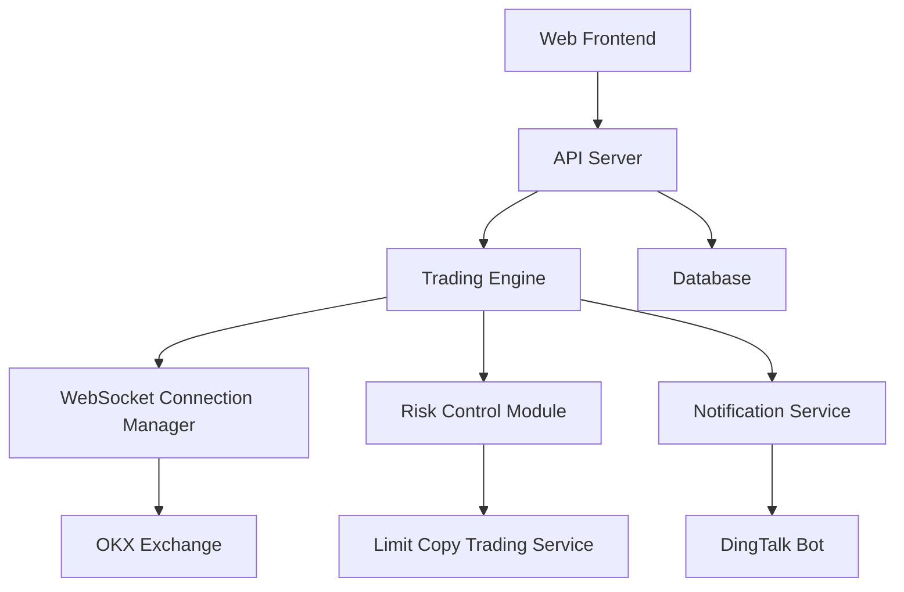

<div align="center">


# 🚀 Cryptocurrency Exchange Auto Copy Trading System

[](https://opensource.org/licenses/MIT)
[](https://www.python.org/)
[](https://getbootstrap.com/)
[](https://github.com/hall130/crypto_trade_for_public)

**Professional cryptocurrency exchange auto copy trading solution supporting OKX and other major exchanges**

[📖 View Docs](#-documentation) • [🚀 Quick Start](#-quick-start) • [💡 Features](#-features) • [📊 Interface Preview](#-interface-preview) • [📞 Support](#-technical-support)

---

## 📋 Table of Contents

- [🎯 Project Overview](#-project-overview) - System overview and core highlights
- [🏗️ System Architecture](#️-system-architecture) - Technical architecture diagram and design philosophy  
- [💡 Features](#-features) - Detailed feature modules description
- [🚀 Quick Start](#-quick-start) - Installation deployment and configuration guide
- [📊 Interface Preview](#-interface-preview) - System interface screenshots showcase
- [📖 Documentation](#-documentation) - Complete documentation navigation
- [🔧 Usage Examples](#-usage-examples) - Configuration and usage examples
- [🛡️ Security Features](#️-security-features) - Security mechanisms description
- [📈 Performance Metrics](#-performance-metrics) - System performance data
- [🌟 Project Highlights](#-project-highlights) - Why choose us and use cases
- [📞 Technical Support](#-technical-support) - Get help and support channels

---

**Language**: [🇨🇳 中文](./README.md) | 🇺🇸 English

</div>

---

## 🎯 Project Overview

This is a professional cryptocurrency exchange auto copy trading system built with modern technology architecture, providing secure, efficient, and user-friendly copy trading solutions. The system supports multi-account management, real-time monitoring, risk control and other core functions, suitable for individual traders and professional institutions.

### ✨ Core Highlights

- 🎯 **Smart Copy Trading**: Support multiple client accounts to follow signal sources for automatic trading
- 🛡️ **Risk Control**: Built-in leverage control, position management, stop-loss mechanisms
- 📊 **Real-time Monitoring**: WebSocket real-time connection monitoring, system health checks
- 🌐 **Web Management**: Modern Web management interface with mobile support
- 🔔 **Smart Notifications**: DingTalk bot notifications for timely trading status updates
- ⚡ **High Performance**: Optimized architecture design supporting large-scale concurrent trading

## 🏗️ System Architecture



### Technical Architecture Features

- **Frontend-Backend Separation**: Modern frontend-backend separation architecture
- **Microservice Design**: Modular service design, easy to scale
- **Real-time Communication**: WebSocket ensures real-time data synchronization
- **Data Persistence**: MySQL database ensures data security
- **Fault Tolerance**: Comprehensive error handling and automatic recovery

## 💡 Features

### 🎯 Core Trading Functions

| Feature Module | Description | Status |
|---------|------|------|
| 🔄 Auto Copy Trading | Support multiple clients following signal sources for automatic open/close positions | ✅ Complete |
| 💰 Limit Copy Trading | Follow signal sources to open positions at discounted prices | ✅ Complete |
| 🛡️ Risk Control | Leverage control, position management, stop-loss mechanisms | ✅ Complete |
| 📊 Position Sync | Automatically detect and fill positions lost due to disconnection | ✅ Complete |
| ⚙️ Strategy Management | Flexible strategy configuration and rule management | ✅ Complete |

### 📱 Management Interface Functions

| Interface Module | Feature Description | Tech Stack |
|---------|---------|--------|
| 🏠 Dashboard | Real-time statistics, chart visualization, system monitoring | Chart.js, Bootstrap |
| 👥 Client Management | Account information management, asset monitoring | HTML5, CSS3 |
| 📡 Signal Source Management | Signal source configuration, status monitoring | JavaScript ES6+ |
| 📈 Trading Records | Historical record queries, data analysis | Responsive Design |
| ⚙️ System Settings | Parameter configuration, maintenance tools | RESTful API |

### 🔧 Advanced Features

- **Connection Management**: Unified WebSocket connection manager
- **Exception Handling**: Comprehensive error handling and automatic recovery mechanisms
- **Performance Monitoring**: Memory usage, database connections, task health monitoring
- **Logging System**: Detailed operation logs and error log recording
- **Data Backup**: Automatic data backup and recovery mechanisms

## 🚀 Quick Start

### Environment Requirements

- **Python**: 3.8+
- **Database**: MySQL 5.7+
- **Operating System**: Windows/Linux/macOS
- **Browser**: Chrome 80+, Firefox 75+, Safari 13+

### Installation Steps

```bash
# 1. Clone project (need to get complete code)
git clone <private-repository>
cd crypto-trading-system

# 2. Install dependencies
pip install -r requirements.txt

# 3. Configure database
mysql -u root -p
CREATE DATABASE trade_db CHARACTER SET utf8mb4;
SOURCE trade_db.sql;

# 4. Configure system
cp config_example.py config.py
# Edit config.py file to set database and API keys

# 5. Start system
python main.py
```

### Quick Configuration

```python
# config.py configuration example
MYSQL_CONFIG = {
    'host': 'localhost',
    'user': 'your_username',
    'password': 'your_password',
    'db': 'trade_db',
    'port': 3306
}

# OKX API configuration
OKX_CONFIG = {
    'api_key': 'your_api_key',
    'secret_key': 'your_secret_key',
    'passphrase': 'your_passphrase'
}
```

## 📊 Interface Preview

<div align="center">

### 🏠 System Dashboard
*Real-time data monitoring and statistical information display*


### ⚙️ Strategy Management Interface
*Flexible strategy configuration and rule management*


### 📊 Current Position Monitoring
*Real-time position monitoring and risk management*


### 📱 Mobile Adaptation
*Perfect mobile responsive design*


### 📈 Trading Interface
*Professional trading monitoring and operation interface*


### 🎯 Feature Showcase
*Comprehensive display of core functions and features*


</div>

### 🖼️ Interface Features

- **🎨 Modern Design**: Adopting latest UI design trends and Bootstrap framework
- **📱 Responsive Layout**: Perfect adaptation to desktop, tablet and mobile devices  
- **⚡ Real-time Updates**: Data auto-refresh, keeping information synchronized
- **🎯 User-friendly**: Intuitive operation interface, reducing learning costs
- **📊 Data Visualization**: Rich charts and statistical information display
- **🔄 Smooth Interaction**: Optimized user experience and interaction feedback

### 📸 Interface Display Description

| Interface Module | Main Functions | Use Cases |
|---------|---------|---------|
| **🏠 System Dashboard** | Real-time monitoring, data statistics, quick overview | Daily monitoring, system status check |
| **⚙️ Strategy Management** | Strategy configuration, rule settings, parameter adjustment | Strategy creation, rule maintenance |
| **📊 Position Monitoring** | Position status, risk control, profit/loss analysis | Trading monitoring, risk management |
| **📱 Mobile Interface** | Touch optimization, simplified operation, mobile access | Mobile office, anytime monitoring |
| **📈 Trading Interface** | Trade execution, order management, historical records | Trading operations, data queries |
| **🎯 Feature Display** | Overall layout, module navigation, function entrance | System introduction, feature demonstration |

> 💡 **View More**: [Frontend Interface Detailed Description](./frontend/README_EN.md#-interface-preview)

## 📖 Documentation

| Document | Description | Status | Link |
|------|------|------|------|
| 📋 Installation Guide | Detailed system installation and configuration steps | ✅ Complete | [View Document](./docs/INSTALLATION_EN.md) |
| 📖 User Manual | Complete user operation guide | ✅ Complete | [View Document](./docs/USER_GUIDE_EN.md) |
| 🔌 API Documentation | Complete API interface documentation | ✅ Complete | [View Document](./docs/API_REFERENCE_EN.md) |
| 🏗️ System Architecture | Detailed technical architecture description | ✅ Complete | [View Document](./docs/ARCHITECTURE_EN.md) |
| 📱 Frontend Documentation | Frontend technology and interface description | ✅ Complete | [View Document](./frontend/README_EN.md) |
| 📝 Changelog | Version updates and feature change records | ✅ Complete | [View Document](./docs/CHANGELOG_EN.md) |
| 🧭 Navigation Index | Complete documentation navigation structure | ✅ Complete | [View Document](./docs/NAVIGATION_EN.md) |

### 🧭 Quick Navigation

- **Beginners**: [Installation Guide](./docs/INSTALLATION_EN.md) → [User Manual](./docs/USER_GUIDE_EN.md) → [Interface Preview](#-interface-preview)
- **Developers**: [System Architecture](./docs/ARCHITECTURE_EN.md) → [API Documentation](./docs/API_REFERENCE_EN.md) → [Frontend Documentation](./frontend/README_EN.md)
- **User Usage**: [Features](#-features) → [Quick Start](#-quick-start) → [Usage Examples](#-usage-examples)

### 📖 [Complete Navigation Index](./docs/NAVIGATION_EN.md)
View detailed documentation navigation structure, including navigation by user type and feature modules

## 🔧 Usage Examples

### Basic Copy Trading Configuration

```javascript
// Create basic copy trading strategy
{
  "strategy_name": "BTC Copy Strategy",
  "signal_source": "trader_001",
  "follow_ratio": 0.1,
  "max_leverage": 10,
  "symbols": ["BTC-USDT-SWAP", "ETH-USDT-SWAP"]
}
```

### Limit Copy Trading Configuration

```javascript
// Create limit copy trading strategy
{
  "strategy_name": "Limit Copy Strategy",
  "discount_rate": 0.02,  // 2% discount
  "max_orders": 4,
  "follow_type": "percentage"
}
```

## 🛡️ Security Features

- 🔐 **API Key Encryption**: All API keys are encrypted for storage
- 🛡️ **Access Control**: Fine-grained user permission management
- 📊 **Risk Monitoring**: Real-time risk monitoring and alert system
- 🔄 **Data Backup**: Automatic data backup and recovery mechanisms
- 📝 **Operation Logs**: Complete operation audit logs

## 📈 Performance Metrics

| Metric | Value | Description |
|------|------|------|
| 🚀 Response Time | <100ms | Average API response time |
| 📊 Concurrent Support | 1000+ | Supported concurrent users |
| 💾 Memory Usage | <512MB | System memory usage |
| 🔄 Connection Stability | 99.9%+ | WebSocket connection stability |
| 📈 Data Processing | 10000+/min | Data processing per minute |

## 🌟 Project Highlights

### Why Choose Our System?

1. **🎯 Professional and Stable**: Extensively tested in live trading, stable and reliable
2. **💡 Easy to Use**: Intuitive Web interface, zero learning curve
3. **🔧 Feature Complete**: From copy trading to risk control, all features included
4. **📱 Responsive Design**: Perfect support for various device access
5. **🚀 High Performance**: Optimized architecture, supports large-scale deployment
6. **🔒 Secure and Reliable**: Banking-level security standards, fund security guaranteed

### Use Cases

- 👨‍💼 **Individual Traders**: Follow professional trader operations
- 🏢 **Investment Institutions**: Multi-account unified management
- 📈 **Fund Companies**: Strategy replication and risk control
- 🤝 **Trading Teams**: Team collaboration and profit sharing

## 📞 Technical Support

### Get Help

- 📧 **Email Support**: [saylas163@gmail.com](mailto:saylas163@gmail.com)
- 🐛 **Issue Feedback**: [Submit Issue](https://github.com/hall130/crypto_trade_for_public/issues)
- 📚 **Documentation Wiki**: [View Wiki](https://github.com/hall130/crypto_trade_for_public/wiki)
- 💬 **Discussion**: [Discussions](https://github.com/hall130/crypto_trade_for_public/discussions)

### Commercial Support

For commercial technical support, custom development or enterprise deployment, please contact us for professional services.

### Community Contribution

Welcome to submit code contributions, feature suggestions and issue feedback!

## 📄 License

This project is licensed under the [MIT License](./LICENSE).

## 🙏 Acknowledgments

Thanks to all developers and users who contributed to the project!

---

<div align="center">

**⭐ If this project helps you, please give it a Star! ⭐**

**Made with ❤️ by [Sylas](https://github.com/hall130)**

</div>

---

> **Disclaimer**: This software is for learning and research purposes only. Please use it within the scope permitted by laws and regulations. Cryptocurrency trading has high risks, please invest cautiously and take responsibility for your own profits and losses. 