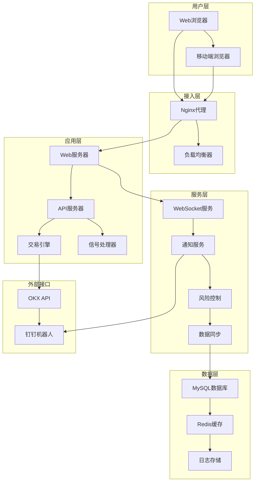
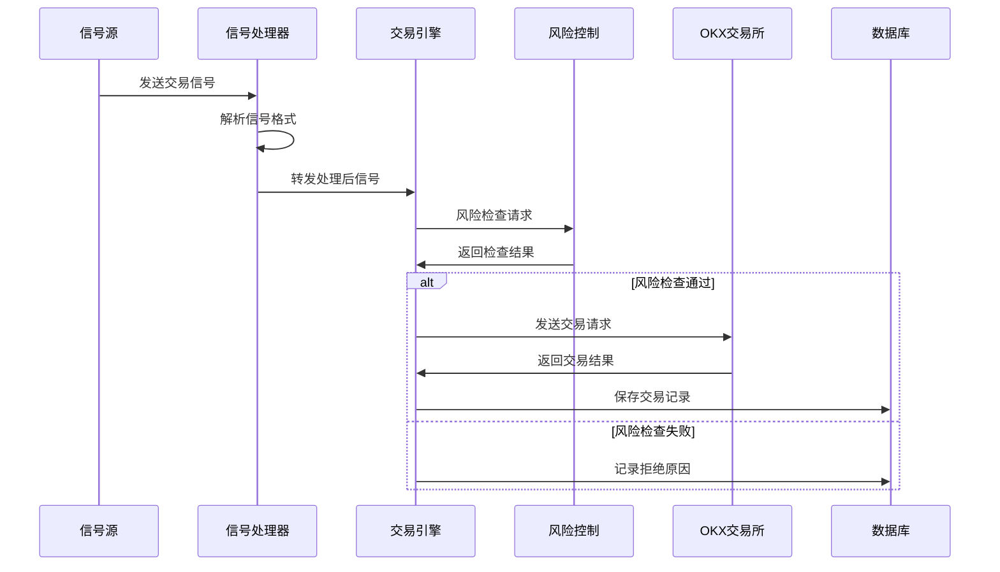
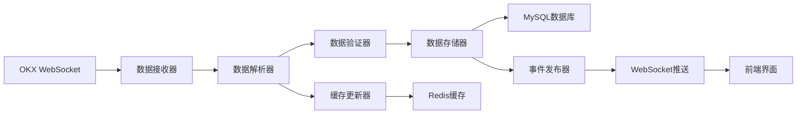

# 🏗️ 系统架构文档

本文档详细介绍了加密货币交易所自动跟单系统的技术架构设计、组件说明和实现原理。

## 📋 目录

- [🎯 架构概览](#-架构概览)
- [🔧 技术栈](#-技术栈)  
- [📱 系统组件](#-系统组件)
- [🔄 数据流设计](#-数据流设计)
- [🗄️ 数据库设计](#️-数据库设计)
- [🌐 网络架构](#-网络架构)
- [🔐 安全架构](#-安全架构)
- [⚡ 性能优化](#-性能优化)
- [🔧 部署架构](#-部署架构)
- [📈 监控体系](#-监控体系)

## 🎯 架构概览

### 系统架构图



### 核心设计理念

1. **📐 分层架构**: 清晰的分层设计，职责分离
2. **🔄 事件驱动**: 基于事件的异步处理机制
3. **🎯 高内聚**: 组件内部功能高度相关
4. **🔗 低耦合**: 组件间依赖关系最小化
5. **📈 可扩展**: 支持水平和垂直扩展
6. **🛡️ 容错性**: 完善的错误处理和恢复机制

## 🔧 技术栈

### 后端技术

#### 核心框架
- **Python 3.8+**: 主要开发语言
- **Flask**: Web框架和API服务
- **SQLAlchemy**: ORM框架
- **APScheduler**: 任务调度框架

#### 数据存储
- **MySQL 8.0+**: 主数据库
- **Redis**: 缓存和会话存储
- **File System**: 日志文件存储

#### 网络通信
- **WebSocket**: 实时数据推送
- **HTTP/HTTPS**: RESTful API
- **JSON**: 数据交换格式

### 前端技术

#### 核心技术
- **HTML5**: 语义化标记
- **CSS3**: 现代样式设计
- **JavaScript ES6+**: 交互逻辑
- **Bootstrap 5**: UI框架

#### 数据可视化
- **Chart.js**: 图表绘制
- **Canvas API**: 自定义图形
- **SVG**: 矢量图形

### 外部依赖

#### 交易所接口
- **OKX API**: 交易所WebSocket和REST API
- **ccxt**: 多交易所支持库

#### 通知服务
- **钉钉机器人**: 消息通知
- **企业微信**: 企业通知
- **邮件服务**: SMTP邮件发送

## 📱 系统组件

### Web服务器 (Flask App)

```python
class WebServer:
    """Web服务器主类"""
    def __init__(self):
        self.app = Flask(__name__)
        self.setup_routes()
        self.setup_middleware()
    
    def setup_routes(self):
        """设置路由"""
        self.app.register_blueprint(api_bp)
        self.app.register_blueprint(web_bp)
    
    def setup_middleware(self):
        """设置中间件"""
        self.app.before_request(auth_middleware)
        self.app.after_request(cors_middleware)
```

**职责**:
- HTTP请求处理
- 静态文件服务
- 模板渲染
- 中间件管理

### API服务器

```python
class APIServer:
    """API服务器"""
    def __init__(self):
        self.routes = {}
        self.middleware = []
    
    def register_route(self, path, handler):
        """注册API路由"""
        self.routes[path] = handler
    
    def process_request(self, request):
        """处理API请求"""
        return self.routes[request.path](request)
```

**功能**:
- RESTful API服务
- 数据格式化
- 参数验证
- 错误处理

### 交易引擎

```python
class TradingEngine:
    """交易引擎核心"""
    def __init__(self):
        self.order_manager = OrderManager()
        self.risk_controller = RiskController()
        self.position_manager = PositionManager()
    
    async def process_signal(self, signal):
        """处理交易信号"""
        # 风险检查
        if not self.risk_controller.check_risk(signal):
            return False
        
        # 生成订单
        orders = self.order_manager.create_orders(signal)
        
        # 执行交易
        for order in orders:
            await self.execute_order(order)
```

**核心功能**:
- 信号解析处理
- 订单生成管理
- 风险控制检查
- 仓位管理同步

### 信号处理器

```python
class SignalProcessor:
    """信号处理器"""
    def __init__(self):
        self.signal_sources = {}
        self.processors = []
    
    def add_source(self, source):
        """添加信号源"""
        self.signal_sources[source.id] = source
    
    def process_signal(self, raw_signal):
        """处理原始信号"""
        signal = self.parse_signal(raw_signal)
        self.validate_signal(signal)
        self.distribute_signal(signal)
```

**主要功能**:
- 多信号源管理
- 信号格式解析
- 信号有效性验证
- 信号分发处理

### WebSocket服务

```python
class WebSocketService:
    """WebSocket服务"""
    def __init__(self):
        self.connections = {}
        self.subscribers = {}
    
    async def handle_connection(self, websocket):
        """处理连接"""
        connection_id = self.generate_id()
        self.connections[connection_id] = websocket
        
        try:
            async for message in websocket:
                await self.handle_message(connection_id, message)
        finally:
            del self.connections[connection_id]
    
    async def broadcast(self, data):
        """广播数据"""
        for connection in self.connections.values():
            await connection.send(json.dumps(data))
```

**服务功能**:
- 实时数据推送
- 连接状态管理
- 消息路由分发
- 断线重连处理

## 🔄 数据流设计

### 信号处理流程



### 数据同步流程



### 订单执行流程

1. **信号接收**: 从信号源接收交易信号
2. **信号解析**: 解析信号格式和内容
3. **策略匹配**: 匹配对应的跟单策略
4. **风险检查**: 执行风险控制检查
5. **订单生成**: 根据策略生成交易订单
6. **订单执行**: 发送订单到交易所
7. **结果处理**: 处理交易结果和状态更新
8. **数据同步**: 同步仓位和账户数据

## 🗄️ 数据库设计

### 核心表结构

#### 客户信息表 (customers)
```sql
CREATE TABLE customers (
    id INT PRIMARY KEY AUTO_INCREMENT,
    name VARCHAR(100) NOT NULL COMMENT '客户名称',
    api_key VARCHAR(255) NOT NULL COMMENT 'API密钥',
    secret_key VARCHAR(255) NOT NULL COMMENT 'Secret密钥', 
    passphrase VARCHAR(100) NOT NULL COMMENT 'API密码',
    status ENUM('active', 'inactive') DEFAULT 'active',
    initial_balance DECIMAL(20,8) DEFAULT 0 COMMENT '初始资金',
    max_leverage INT DEFAULT 1 COMMENT '最大杠杆',
    created_at TIMESTAMP DEFAULT CURRENT_TIMESTAMP,
    updated_at TIMESTAMP DEFAULT CURRENT_TIMESTAMP ON UPDATE CURRENT_TIMESTAMP,
    
    INDEX idx_status (status),
    INDEX idx_created_at (created_at)
);
```

#### 策略配置表 (strategies)
```sql
CREATE TABLE strategies (
    id INT PRIMARY KEY AUTO_INCREMENT,
    name VARCHAR(100) NOT NULL COMMENT '策略名称',
    signal_source_id INT NOT NULL COMMENT '信号源ID',
    follow_ratio DECIMAL(10,4) DEFAULT 0.1 COMMENT '跟随比例',
    max_leverage INT DEFAULT 1 COMMENT '最大杠杆',
    symbols TEXT COMMENT '交易对列表',
    status ENUM('active', 'inactive') DEFAULT 'active',
    created_at TIMESTAMP DEFAULT CURRENT_TIMESTAMP,
    
    INDEX idx_signal_source (signal_source_id),
    INDEX idx_status (status)
);
```

#### 交易记录表 (trades)
```sql
CREATE TABLE trades (
    id BIGINT PRIMARY KEY AUTO_INCREMENT,
    customer_id INT NOT NULL COMMENT '客户ID',
    strategy_id INT COMMENT '策略ID',
    symbol VARCHAR(50) NOT NULL COMMENT '交易对',
    side ENUM('buy', 'sell') NOT NULL COMMENT '交易方向',
    amount DECIMAL(20,8) NOT NULL COMMENT '交易数量',
    price DECIMAL(20,8) COMMENT '交易价格',
    order_type VARCHAR(20) DEFAULT 'market' COMMENT '订单类型',
    status VARCHAR(20) DEFAULT 'pending' COMMENT '交易状态',
    order_id VARCHAR(100) COMMENT '交易所订单ID',
    signal_id VARCHAR(100) COMMENT '信号ID',
    created_at TIMESTAMP DEFAULT CURRENT_TIMESTAMP,
    
    INDEX idx_customer_id (customer_id),
    INDEX idx_symbol (symbol),
    INDEX idx_created_at (created_at),
    INDEX idx_status (status)
);
```

### 数据库优化

#### 索引优化
```sql
-- 复合索引优化查询
ALTER TABLE trades ADD INDEX idx_customer_symbol_time (customer_id, symbol, created_at);
ALTER TABLE positions ADD INDEX idx_customer_symbol (customer_id, symbol);

-- 覆盖索引减少回表
ALTER TABLE customers ADD INDEX idx_status_name (status, name);
```

#### 分区表设计
```sql
-- 按月分区交易记录表
ALTER TABLE trades PARTITION BY RANGE (YEAR(created_at)*100 + MONTH(created_at))
(
    PARTITION p202401 VALUES LESS THAN (202402),
    PARTITION p202402 VALUES LESS THAN (202403),
    PARTITION p202403 VALUES LESS THAN (202404),
    PARTITION p_max VALUES LESS THAN MAXVALUE
);
```

## 🌐 网络架构

### 负载均衡配置

```nginx
upstream backend {
    server 127.0.0.1:5000 weight=3;
    server 127.0.0.1:5001 weight=2;
    server 127.0.0.1:5002 weight=1;
    
    keepalive 32;
}

server {
    listen 80;
    server_name trading.example.com;
    
    location / {
        proxy_pass http://backend;
        proxy_set_header Host $host;
        proxy_set_header X-Real-IP $remote_addr;
        proxy_set_header X-Forwarded-For $proxy_add_x_forwarded_for;
    }
    
    location /ws/ {
        proxy_pass http://backend;
        proxy_http_version 1.1;
        proxy_set_header Upgrade $http_upgrade;
        proxy_set_header Connection "upgrade";
    }
}
```

### API网关设计

```python
class APIGateway:
    """API网关"""
    def __init__(self):
        self.rate_limiter = RateLimiter()
        self.auth_service = AuthService()
        self.router = Router()
    
    async def handle_request(self, request):
        """处理请求"""
        # 限流检查
        if not self.rate_limiter.allow(request):
            return Response(status=429)
        
        # 身份验证
        if not self.auth_service.verify(request):
            return Response(status=401)
        
        # 路由转发
        return await self.router.route(request)
```

## 🔐 安全架构

### 认证授权体系

```python
class AuthSystem:
    """认证系统"""
    def __init__(self):
        self.jwt_manager = JWTManager()
        self.permission_manager = PermissionManager()
    
    def authenticate(self, credentials):
        """用户认证"""
        user = self.verify_credentials(credentials)
        if user:
            token = self.jwt_manager.create_token(user)
            return {'token': token, 'user': user}
        return None
    
    def authorize(self, token, resource):
        """权限验证"""
        user = self.jwt_manager.verify_token(token)
        return self.permission_manager.check_permission(user, resource)
```

### 数据加密

```python
class EncryptionService:
    """加密服务"""
    def __init__(self, key):
        self.cipher = Fernet(key)
    
    def encrypt_api_key(self, api_key):
        """加密API密钥"""
        return self.cipher.encrypt(api_key.encode()).decode()
    
    def decrypt_api_key(self, encrypted_key):
        """解密API密钥"""
        return self.cipher.decrypt(encrypted_key.encode()).decode()
```

### 安全防护措施

1. **🔐 数据加密**: API密钥和敏感信息加密存储
2. **🛡️ 访问控制**: 基于角色的权限管理
3. **🚫 防护攻击**: SQL注入、XSS攻击防护
4. **📝 审计日志**: 完整的操作日志记录
5. **🔒 传输安全**: HTTPS/WSS加密传输

## ⚡ 性能优化

### 缓存策略

```python
class CacheManager:
    """缓存管理器"""
    def __init__(self):
        self.redis_client = redis.Redis()
        self.local_cache = {}
    
    def get_or_set(self, key, factory, ttl=300):
        """获取或设置缓存"""
        # 本地缓存
        if key in self.local_cache:
            return self.local_cache[key]
        
        # Redis缓存
        value = self.redis_client.get(key)
        if value:
            self.local_cache[key] = json.loads(value)
            return self.local_cache[key]
        
        # 生成新数据
        value = factory()
        self.redis_client.setex(key, ttl, json.dumps(value))
        self.local_cache[key] = value
        return value
```

### 数据库优化

1. **📊 连接池**: 数据库连接池管理
2. **📝 查询优化**: SQL查询语句优化
3. **📈 索引优化**: 合理的索引设计
4. **🔄 读写分离**: 主从数据库分离
5. **📦 数据分区**: 大表分区存储

### 异步处理

```python
import asyncio
from concurrent.futures import ThreadPoolExecutor

class AsyncProcessor:
    """异步处理器"""
    def __init__(self):
        self.executor = ThreadPoolExecutor(max_workers=10)
    
    async def process_signals(self, signals):
        """并发处理信号"""
        tasks = []
        for signal in signals:
            task = asyncio.create_task(self.process_single_signal(signal))
            tasks.append(task)
        
        results = await asyncio.gather(*tasks, return_exceptions=True)
        return results
    
    async def process_single_signal(self, signal):
        """处理单个信号"""
        loop = asyncio.get_event_loop()
        return await loop.run_in_executor(self.executor, self._sync_process, signal)
```

## 🔧 部署架构

### Docker容器化

```dockerfile
# Dockerfile
FROM python:3.8-slim

WORKDIR /app

COPY requirements.txt .
RUN pip install -r requirements.txt

COPY . .

EXPOSE 5000

CMD ["python", "main.py"]
```

```yaml
# docker-compose.yml
version: '3.8'

services:
  web:
    build: .
    ports:
      - "5000:5000"
    environment:
      - MYSQL_HOST=db
      - REDIS_HOST=redis
    depends_on:
      - db
      - redis
  
  db:
    image: mysql:8.0
    environment:
      MYSQL_ROOT_PASSWORD: password
      MYSQL_DATABASE: trade_db
    volumes:
      - mysql_data:/var/lib/mysql
  
  redis:
    image: redis:7-alpine
    volumes:
      - redis_data:/data

volumes:
  mysql_data:
  redis_data:
```

### Kubernetes部署

```yaml
# deployment.yaml
apiVersion: apps/v1
kind: Deployment
metadata:
  name: trading-system
spec:
  replicas: 3
  selector:
    matchLabels:
      app: trading-system
  template:
    metadata:
      labels:
        app: trading-system
    spec:
      containers:
      - name: trading-system
        image: trading-system:latest
        ports:
        - containerPort: 5000
        env:
        - name: MYSQL_HOST
          value: "mysql-service"
        - name: REDIS_HOST
          value: "redis-service"
```

## 📈 监控体系

### 应用监控

```python
class MonitoringService:
    """监控服务"""
    def __init__(self):
        self.metrics = {}
        self.alerts = []
    
    def record_metric(self, name, value, tags=None):
        """记录指标"""
        self.metrics[name] = {
            'value': value,
            'timestamp': time.time(),
            'tags': tags or {}
        }
    
    def check_alerts(self):
        """检查告警"""
        for metric_name, metric_data in self.metrics.items():
            if self.should_alert(metric_name, metric_data):
                self.send_alert(metric_name, metric_data)
```

### 健康检查

```python
@app.route('/health')
def health_check():
    """健康检查端点"""
    health_status = {
        'status': 'healthy',
        'timestamp': datetime.utcnow().isoformat(),
        'checks': {
            'database': check_database_connection(),
            'redis': check_redis_connection(),
            'okx_api': check_okx_api_connection(),
            'websocket': check_websocket_service()
        }
    }
    
    overall_healthy = all(health_status['checks'].values())
    if not overall_healthy:
        health_status['status'] = 'unhealthy'
        return jsonify(health_status), 503
    
    return jsonify(health_status), 200
```

### 日志体系

```python
import logging
from logging.handlers import RotatingFileHandler

class LoggingConfig:
    """日志配置"""
    @staticmethod
    def setup_logging():
        # 根日志器
        root_logger = logging.getLogger()
        root_logger.setLevel(logging.INFO)
        
        # 文件处理器
        file_handler = RotatingFileHandler(
            'logs/app.log',
            maxBytes=10*1024*1024,  # 10MB
            backupCount=5
        )
        file_handler.setFormatter(logging.Formatter(
            '%(asctime)s %(levelname)s %(name)s: %(message)s'
        ))
        
        # 控制台处理器
        console_handler = logging.StreamHandler()
        console_handler.setFormatter(logging.Formatter(
            '%(levelname)s: %(message)s'
        ))
        
        root_logger.addHandler(file_handler)
        root_logger.addHandler(console_handler)
```

## 📚 相关文档

- [📋 安装指南](./INSTALLATION.md) - 系统安装部署
- [📖 用户手册](./USER_GUIDE.md) - 功能使用指南  
- [🔌 API文档](./API_REFERENCE.md) - 接口详细说明
- [📱 前端文档](../frontend/README.md) - 前端技术文档
- [📝 更新日志](./CHANGELOG.md) - 版本更新记录

## 🔧 开发指南

### 代码结构

```
project/
├── app/                    # 应用主目录
│   ├── api/               # API接口
│   ├── services/          # 业务服务
│   ├── models/            # 数据模型
│   ├── utils/             # 工具函数
│   └── config/            # 配置文件
├── frontend/              # 前端代码
├── tests/                 # 测试代码
├── docs/                  # 文档目录
├── deploy/                # 部署脚本
└── scripts/               # 工具脚本
```

### 开发规范

1. **🎯 代码规范**: 遵循PEP 8编码规范
2. **📝 文档规范**: 完善的代码注释和文档
3. **🧪 测试规范**: 单元测试和集成测试
4. **🔄 版本管理**: Git工作流和版本标签
5. **🚀 部署规范**: 自动化部署和回滚

## 📞 技术支持

如有架构相关问题，请联系：

- **GitHub Issues**: [提交问题](https://github.com/hall130/crypto_trade_for_public/issues)
- **邮箱支持**: saylas163@gmail.com
- **文档中心**: [查看更多文档](../README.md#-文档目录)

---

> **更新时间**: 2024-01-15  
> **文档版本**: v1.0.0  
> **架构版本**: v1.0.0 