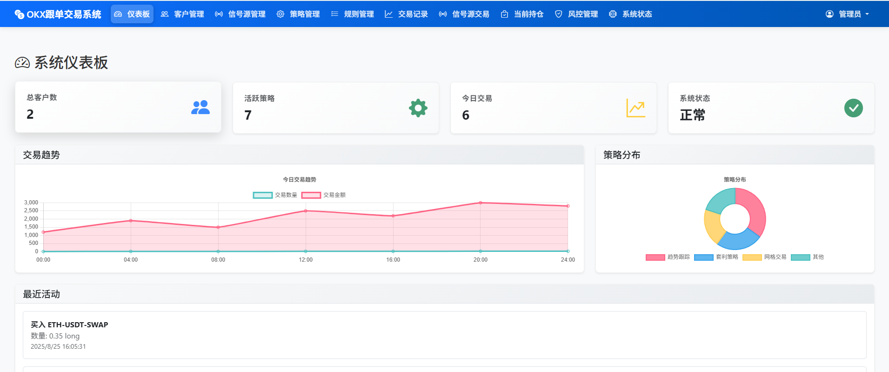
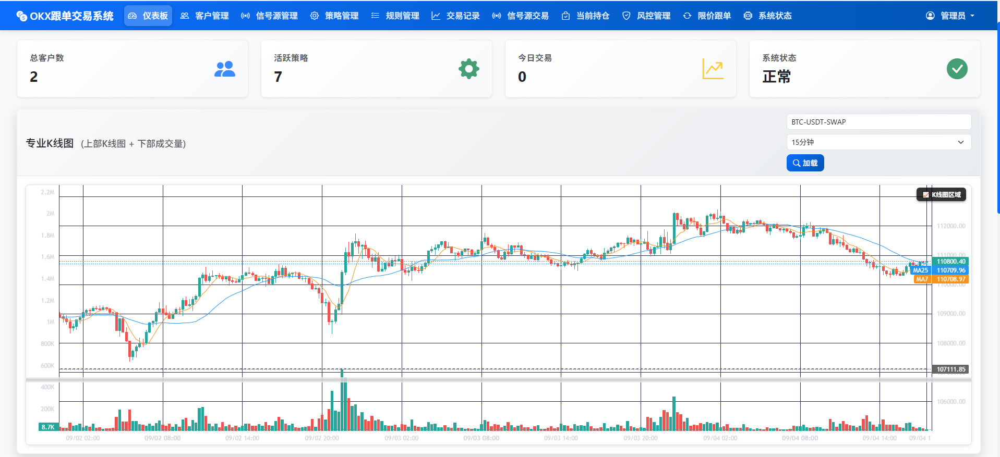

# OKX跟单交易系统 - 前端管理界面

<div align="center">



**现代化Web管理控制台**

[](https://developer.mozilla.org/en-US/docs/Web/HTML)
[](https://developer.mozilla.org/en-US/docs/Web/CSS)
[](https://developer.mozilla.org/en-US/docs/Web/JavaScript)
[](https://getbootstrap.com/)
[](https://www.chartjs.org/)

</div>

## 📋 目录

- [🎯 界面概述](#-界面概述)
- [🏗️ 页面结构](#️-页面结构)
- [📊 功能模块](#-功能模块)
- [🛠️ 技术实现](#️-技术实现)
- [📱 界面预览](#-界面预览)
- [📖 操作指南](#-操作指南)
- [⚙️ 配置说明](#️-配置说明)
- [❓ 常见问题](#-常见问题)
- [🔧 开发指南](#-开发指南)
- [📞 技术支持](#-技术支持)

## 🎯 界面概述

前端管理界面是OKX跟单交易系统的核心用户界面，提供直观、现代化的Web管理控制台。界面采用响应式设计，支持桌面端、平板和移动端访问，为用户提供完整的交易管理功能。

### ✨ 核心特性

- 🎨 **现代化设计**: 采用Bootstrap 5框架，界面美观现代
- 📱 **响应式布局**: 完美适配不同屏幕尺寸
- ⚡ **实时更新**: 后台自动刷新，数据实时同步
- 🔐 **安全认证**: 完善的用户认证和权限管理
- 📊 **数据可视化**: 丰富的图表和统计信息展示
- 🚀 **高性能**: 优化的代码结构和加载机制
- 🔄 **自动刷新**: 智能的后台数据更新机制
- 🎯 **用户友好**: 直观的操作界面和交互体验

## 🏗️ 页面结构

### 文件结构

```
frontend/
├── 📄 index.html          # 主管理界面
├── 📄 login.html          # 登录页面
├── 📄 app.js              # 主要JavaScript逻辑
├── 📄 styles.css          # 自定义样式
├── 📄 config.js           # 前端配置文件
├── 📄 README.md           # 前端文档
└── 📁 img/                # 图片资源
    ├── logo.png           # 系统Logo
    ├── dashboard.png      # 仪表盘预览
    └── interface.png      # 界面预览
```

### 页面布局

#### 主界面布局
```

```

#### 响应式设计
- **桌面端 (≥1200px)**: 侧边栏固定，主内容区域自适应
- **平板端 (768px-1199px)**: 侧边栏可折叠，主内容区域占主导
- **移动端 (<768px)**: 侧边栏隐藏，主内容区域全屏显示

## 📊 功能模块

### 🏠 仪表盘 (Dashboard)

**功能描述**: 系统概览和关键指标展示

**主要特性**:
- 📈 实时统计数据显示
- 📊 图表可视化展示
- 🔄 自动数据刷新
- 📱 响应式布局适配
- 🎯 关键指标监控

**界面元素**:
- 统计卡片 (总客户数、今日交易、活跃策略、系统状态)
- 图表区域 (交易趋势、收益分析)
- 最近活动列表
- 快速操作按钮
- 系统状态指示器

**数据展示**:
```javascript
// 统计卡片数据
{
  total_customers: 25,
  today_trades: 156,
  active_strategies: 8,
  system_status: "正常"
}
```

### 👥 客户管理

**功能描述**: 客户账户信息管理和监控

**主要特性**:
- 🔍 客户信息搜索和筛选
- 📊 客户资产状态监控
- 📈 交易历史查询
- ⚙️ 客户权限配置
- 💰 资产信息管理

**界面元素**:
- 客户列表表格
- 搜索和筛选表单
- 客户详情弹窗
- 操作按钮 (编辑、删除、查看详情)
- 资产信息展示

**功能操作**:
- 添加新客户
- 编辑客户信息
- 查看客户详情
- 删除客户账户
- 资产信息更新

### 📡 信号源管理

**功能描述**: 信号源配置和状态监控

**主要特性**:
- 📡 信号源状态监控
- ⚙️ 信号源配置管理
- 📊 信号源性能分析
- 🔄 实时数据同步
- 📈 历史数据查看

**界面元素**:
- 信号源列表
- 状态指示器
- 配置表单
- 性能图表
- 操作控制面板

### 📊 策略管理

**功能描述**: 交易策略配置和管理

**主要特性**:
- 📋 策略列表管理
- ⚙️ 策略参数配置
- 📈 策略性能分析
- 🔄 策略状态监控
- 📊 策略统计信息

**界面元素**:
- 策略列表表格
- 策略配置表单
- 性能分析图表
- 状态监控面板
- 操作控制按钮

### 📈 交易记录

**功能描述**: 交易历史记录查询和分析

**主要特性**:
- 📋 交易记录列表
- 🔍 高级搜索功能
- 📊 交易统计分析
- 📈 图表可视化
- 📄 数据导出功能

**界面元素**:
- 交易记录表格
- 搜索和筛选工具
- 统计图表
- 详情查看面板
- 导出功能按钮

### ⚙️ 系统设置

**功能描述**: 系统配置和参数设置

**主要特性**:
- ⚙️ 系统参数配置
- 🔐 安全设置
- 📊 数据管理
- 🔄 系统维护
- 📈 性能监控

**界面元素**:
- 配置表单
- 设置面板
- 系统状态监控
- 维护工具
- 日志查看器

## 🛠️ 技术实现

### 前端技术栈

#### 核心技术
- **HTML5**: 语义化标记语言
- **CSS3**: 现代化样式表
- **JavaScript ES6+**: 现代JavaScript特性
- **Bootstrap 5**: 响应式UI框架

#### 数据可视化
- **Chart.js**: 图表库
- **Canvas API**: 自定义图表绘制
- **SVG**: 矢量图形支持

#### 网络通信
- **Fetch API**: 现代HTTP请求
- **WebSocket**: 实时数据推送
- **AJAX**: 异步数据加载

### 代码架构

#### 模块化设计
```javascript
// 主要模块结构
├── app.js              # 主应用逻辑
├── modules/
│   ├── dashboard.js    # 仪表盘模块
│   ├── customers.js    # 客户管理模块
│   ├── signals.js      # 信号源模块
│   ├── strategies.js   # 策略管理模块
│   ├── trades.js       # 交易记录模块
│   └── settings.js     # 系统设置模块
├── utils/
│   ├── api.js          # API通信工具
│   ├── charts.js       # 图表工具
│   └── helpers.js      # 辅助函数
└── config/
    └── config.js       # 配置文件
```

#### 核心功能实现

**自动刷新机制**:
```javascript
class AutoRefresh {
    constructor(interval = 30000) {
        this.interval = interval;
        this.timer = null;
        this.isEnabled = true;
    }
    
    start() {
        if (this.isEnabled) {
            this.timer = setInterval(() => {
                this.refreshData();
            }, this.interval);
        }
    }
    
    stop() {
        if (this.timer) {
            clearInterval(this.timer);
            this.timer = null;
        }
    }
    
    refreshData() {
        // 刷新各个模块的数据
        this.refreshDashboard();
        this.refreshCustomers();
        this.refreshSignals();
    }
}
```

**API通信模块**:
```javascript
class APIClient {
    constructor(baseURL = '/api/v1') {
        this.baseURL = baseURL;
    }
    
    async request(endpoint, options = {}) {
        const url = `${this.baseURL}${endpoint}`;
        const config = {
            headers: {
                'Content-Type': 'application/json',
                ...options.headers
            },
            ...options
        };
        
        try {
            const response = await fetch(url, config);
            if (!response.ok) {
                throw new Error(`HTTP ${response.status}: ${response.statusText}`);
            }
            return await response.json();
        } catch (error) {
            console.error('API请求失败:', error);
            throw error;
        }
    }
    
    async get(endpoint) {
        return this.request(endpoint, { method: 'GET' });
    }
    
    async post(endpoint, data) {
        return this.request(endpoint, {
            method: 'POST',
            body: JSON.stringify(data)
        });
    }
}
```

**图表组件**:
```javascript
class ChartManager {
    constructor() {
        this.charts = new Map();
    }
    
    createChart(canvasId, type, data, options = {}) {
        const ctx = document.getElementById(canvasId);
        if (!ctx) {
            console.error(`Canvas元素不存在: ${canvasId}`);
            return null;
        }
        
        const chart = new Chart(ctx, {
            type: type,
            data: data,
            options: {
                responsive: true,
                maintainAspectRatio: false,
                ...options
            }
        });
        
        this.charts.set(canvasId, chart);
        return chart;
    }
    
    updateChart(canvasId, newData) {
        const chart = this.charts.get(canvasId);
        if (chart) {
            chart.data = newData;
            chart.update();
        }
    }
    
    destroyChart(canvasId) {
        const chart = this.charts.get(canvasId);
        if (chart) {
            chart.destroy();
            this.charts.delete(canvasId);
        }
    }
}
```

### 响应式设计

#### 断点设置
```css
/* 移动端 */
@media (max-width: 767.98px) {
    .sidebar {
        display: none;
    }
    
    .main-content {
        margin-left: 0;
        padding: 10px;
    }
}

/* 平板端 */
@media (min-width: 768px) and (max-width: 1199.98px) {
    .sidebar {
        width: 200px;
    }
    
    .main-content {
        margin-left: 200px;
    }
}

/* 桌面端 */
@media (min-width: 1200px) {
    .sidebar {
        width: 250px;
    }
    
    .main-content {
        margin-left: 250px;
    }
}
```

#### 组件适配
```css
/* 统计卡片响应式 */
.stats-card {
    width: 100%;
    margin-bottom: 20px;
}

@media (min-width: 768px) {
    .stats-card {
        width: calc(50% - 10px);
        margin-right: 10px;
    }
}

@media (min-width: 1200px) {
    .stats-card {
        width: calc(25% - 15px);
        margin-right: 15px;
    }
}
```

## 📱 界面预览

### 桌面端界面
- **主界面**: 现代化的侧边栏导航设计
- **仪表盘**: 丰富的统计卡片和图表展示
- **数据表格**: 功能完整的表格组件
- **响应式布局**: 自适应不同屏幕尺寸

### 移动端界面
- **触摸友好**: 优化的触摸操作体验
- **简化导航**: 移动端优化的导航菜单
- **快速操作**: 便捷的操作按钮布局
- **数据展示**: 移动端优化的数据展示

### 界面特色
- 🎨 **现代化设计**: 采用最新的设计趋势
- 📱 **完美适配**: 支持所有主流设备
- ⚡ **快速响应**: 优化的加载和交互性能
- 🎯 **用户友好**: 直观的操作界面

## 📖 操作指南

### 快速开始

#### 1. 访问系统
1. 打开浏览器，访问系统地址
2. 输入用户名和密码登录
3. 进入主管理界面

#### 2. 导航操作
- **侧边栏导航**: 点击左侧菜单切换功能模块
- **面包屑导航**: 查看当前位置和快速返回
- **搜索功能**: 使用顶部搜索框快速查找

#### 3. 数据操作
- **查看数据**: 点击列表项查看详细信息
- **编辑数据**: 点击编辑按钮修改信息
- **删除数据**: 点击删除按钮移除记录
- **导出数据**: 使用导出功能下载数据

### 功能操作详解

#### 仪表盘使用
1. **查看统计信息**: 浏览统计卡片了解系统状态
2. **分析图表数据**: 查看图表了解趋势变化
3. **监控系统状态**: 关注系统健康状态指示器
4. **快速操作**: 使用快捷按钮执行常用操作

#### 客户管理操作
1. **添加客户**: 点击"添加客户"按钮创建新客户
2. **编辑客户**: 在客户列表中点击编辑按钮
3. **查看详情**: 点击客户名称查看详细信息
4. **搜索筛选**: 使用搜索框和筛选条件查找客户

#### 信号源管理
1. **监控状态**: 查看信号源连接状态
2. **配置参数**: 设置信号源相关参数
3. **查看性能**: 分析信号源性能数据
4. **管理配置**: 管理信号源配置信息

#### 策略管理
1. **创建策略**: 设置新的交易策略
2. **配置参数**: 调整策略参数设置
3. **监控执行**: 查看策略执行状态
4. **分析效果**: 分析策略执行效果

### 快捷键操作
- `Ctrl + F`: 快速搜索
- `Ctrl + R`: 刷新数据
- `Ctrl + S`: 保存设置
- `Esc`: 关闭弹窗
- `F5`: 刷新页面

## ⚙️ 配置说明

### 前端配置

#### 配置文件 (config.js)
```javascript
const CONFIG = {
    // API配置
    API_BASE_URL: '/api/v1',
    API_TIMEOUT: 30000,
    
    // 自动刷新配置
    AUTO_REFRESH_INTERVAL: 30000,
    AUTO_REFRESH_ENABLED: true,
    
    // 图表配置
    CHART_COLORS: ['#007bff', '#28a745', '#ffc107', '#dc3545'],
    CHART_ANIMATION: true,
    
    // 分页配置
    PAGE_SIZE: 20,
    MAX_PAGE_SIZE: 100,
    
    // 主题配置
    THEME: 'light',
    LANGUAGE: 'zh-CN'
};
```

#### 样式配置 (styles.css)
```css
:root {
    /* 主色调 */
    --primary-color: #007bff;
    --secondary-color: #6c757d;
    --success-color: #28a745;
    --warning-color: #ffc107;
    --danger-color: #dc3545;
    
    /* 字体设置 */
    --font-family: 'Segoe UI', Tahoma, Geneva, Verdana, sans-serif;
    --font-size-base: 14px;
    --font-size-lg: 16px;
    --font-size-sm: 12px;
    
    /* 间距设置 */
    --spacing-xs: 4px;
    --spacing-sm: 8px;
    --spacing-md: 16px;
    --spacing-lg: 24px;
    --spacing-xl: 32px;
}
```

### 环境配置

#### 开发环境
```bash
# 开发服务器配置
PORT=3000
API_URL=http://localhost:5000/api/v1
DEBUG=true
```

#### 生产环境
```bash
# 生产环境配置
PORT=80
API_URL=https://api.example.com/api/v1
DEBUG=false
```

### 浏览器兼容性

#### 支持的浏览器
- **Chrome**: 80+
- **Firefox**: 75+
- **Safari**: 13+
- **Edge**: 80+

#### 功能支持
- **ES6+**: 现代JavaScript特性
- **CSS Grid**: 现代布局系统
- **Flexbox**: 弹性布局
- **Fetch API**: 现代HTTP请求
- **LocalStorage**: 本地存储

## ❓ 常见问题

### 界面显示问题

#### Q: 页面显示不正常怎么办？
**A**: 请检查以下项目：
1. 确保浏览器版本支持
2. 清除浏览器缓存
3. 检查网络连接
4. 刷新页面重试

#### Q: 图表不显示怎么办？
**A**: 可能的解决方案：
1. 检查JavaScript是否启用
2. 确认Chart.js库已加载
3. 检查数据格式是否正确
4. 查看浏览器控制台错误信息

#### Q: 移动端显示异常？
**A**: 建议操作：
1. 使用响应式设计模式
2. 检查视口设置
3. 确认CSS媒体查询正确
4. 测试不同设备尺寸

### 功能操作问题

#### Q: 数据不自动刷新？
**A**: 检查设置：
1. 确认自动刷新功能已启用
2. 检查刷新间隔设置
3. 查看网络连接状态
4. 检查API服务是否正常

#### Q: 搜索功能不工作？
**A**: 排查步骤：
1. 确认搜索关键词正确
2. 检查搜索范围设置
3. 查看API响应状态
4. 确认数据格式匹配

#### Q: 导出功能失败？
**A**: 解决方案：
1. 检查文件权限设置
2. 确认浏览器下载设置
3. 查看服务器响应
4. 尝试不同文件格式

### 性能优化问题

#### Q: 页面加载缓慢？
**A**: 优化建议：
1. 启用浏览器缓存
2. 压缩静态资源
3. 使用CDN加速
4. 优化图片大小

#### Q: 数据加载超时？
**A**: 处理方法：
1. 检查网络连接
2. 增加超时时间设置
3. 优化API响应
4. 使用分页加载

#### Q: 内存占用过高？
**A**: 优化措施：
1. 及时清理图表实例
2. 优化数据缓存策略
3. 减少DOM操作
4. 使用虚拟滚动

## 🔧 开发指南

### 开发环境搭建

#### 1. 环境要求
```bash
# Node.js版本
node >= 14.0.0
npm >= 6.0.0

# 浏览器要求
Chrome >= 80
Firefox >= 75
Safari >= 13
```

#### 2. 项目结构
```
frontend/
├── src/
│   ├── js/
│   │   ├── app.js
│   │   ├── modules/
│   │   └── utils/
│   ├── css/
│   │   ├── styles.css
│   │   └── components/
│   └── html/
│       ├── index.html
│       └── components/
├── dist/
├── assets/
└── docs/
```

#### 3. 开发工具
```bash
# 代码编辑器
VS Code (推荐)
Sublime Text
WebStorm

# 浏览器开发工具
Chrome DevTools
Firefox Developer Tools
Safari Web Inspector
```

### 代码规范

#### JavaScript规范
```javascript
// 使用ES6+语法
const apiClient = new APIClient();

// 使用async/await
async function fetchData() {
    try {
        const response = await apiClient.get('/data');
        return response.data;
    } catch (error) {
        console.error('获取数据失败:', error);
        throw error;
    }
}

// 使用箭头函数
const handleClick = (event) => {
    event.preventDefault();
    // 处理点击事件
};

// 使用解构赋值
const { name, value } = formData;
```

#### CSS规范
```css
/* 使用CSS变量 */
:root {
    --primary-color: #007bff;
    --spacing-md: 16px;
}

/* 使用Flexbox布局 */
.container {
    display: flex;
    justify-content: center;
    align-items: center;
    gap: var(--spacing-md);
}

/* 使用Grid布局 */
.grid {
    display: grid;
    grid-template-columns: repeat(auto-fit, minmax(300px, 1fr));
    gap: var(--spacing-md);
}

/* 响应式设计 */
@media (max-width: 768px) {
    .container {
        flex-direction: column;
    }
}
```

#### HTML规范
```html
<!-- 语义化标签 -->
<header class="header">
    <nav class="navbar">
        <ul class="nav-list">
            <li class="nav-item">
                <a href="#dashboard" class="nav-link">仪表盘</a>
            </li>
        </ul>
    </nav>
</header>

<main class="main-content">
    <section class="dashboard">
        <h1 class="section-title">系统概览</h1>
        <div class="stats-grid">
            <!-- 统计卡片 -->
        </div>
    </section>
</main>
```

### 调试技巧

#### 浏览器调试
```javascript
// 使用console调试
console.log('调试信息:', data);
console.error('错误信息:', error);
console.warn('警告信息:', warning);

// 使用debugger断点
function processData(data) {
    debugger; // 浏览器会在这里暂停
    return data.map(item => item.value);
}

// 性能监控
console.time('操作耗时');
// 执行操作
console.timeEnd('操作耗时');
```

#### 网络调试
```javascript
// 监控API请求
const originalFetch = window.fetch;
window.fetch = function(...args) {
    console.log('API请求:', args);
    return originalFetch.apply(this, args);
};

// 监控WebSocket连接
const ws = new WebSocket('ws://localhost:8080');
ws.onopen = () => console.log('WebSocket连接成功');
ws.onmessage = (event) => console.log('收到消息:', event.data);
ws.onerror = (error) => console.error('WebSocket错误:', error);
```

### 测试指南

#### 单元测试
```javascript
// 使用Jest进行单元测试
describe('API客户端测试', () => {
    test('应该能正确发送GET请求', async () => {
        const client = new APIClient();
        const mockResponse = { data: 'test' };
        
        global.fetch = jest.fn(() =>
            Promise.resolve({
                ok: true,
                json: () => Promise.resolve(mockResponse)
            })
        );
        
        const result = await client.get('/test');
        expect(result).toEqual(mockResponse);
    });
});
```

#### 集成测试
```javascript
// 测试页面功能
describe('仪表盘功能测试', () => {
    beforeEach(() => {
        document.body.innerHTML = `
            <div id="dashboard">
                <div id="stats-container"></div>
                <canvas id="chart"></canvas>
            </div>
        `;
    });
    
    test('应该能正确显示统计信息', () => {
        const statsContainer = document.getElementById('stats-container');
        expect(statsContainer).toBeTruthy();
    });
});
```

## 📞 技术支持

### 联系方式

- **项目地址**: [GitHub Repository](https://github.com/hall130/okx_exchange)
- **问题反馈**: [Issues Page](https://github.com/hall130/okx_exchange/issues)
- **文档更新**: [Wiki Page](https://github.com/hall130/okx_exchange/wiki)
- **邮箱支持**: saylas163@gmail.com

### 问题反馈

#### 反馈模板
```
**问题描述**:
简要描述遇到的问题

**重现步骤**:
1. 第一步
2. 第二步
3. 第三步

**期望结果**:
描述期望的正确行为

**实际结果**:
描述实际发生的情况

**环境信息**:
- 浏览器: Chrome 90.0.4430.212
- 操作系统: Windows 10
- 系统版本: v1.2.0

**附加信息**:
截图、错误日志等
```

### 更新日志

#### v1.2.0 (2025-08-26)
- ✨ 新增自动刷新功能
- 🎨 界面设计优化
- 📱 移动端适配改进
- ⚡ 性能优化提升
- 🐛 修复已知问题

#### v1.1.0 (2025-08-01)
- ✅ 完整的界面功能
- ✅ 响应式设计
- ✅ 数据可视化
- ✅ 用户交互优化

#### v1.0.0 (2025-06-25)
- 🎉 初始版本发布
- ✅ 基础界面功能
- ✅ 核心模块实现

---

<div align="center">

**如果这个项目对您有帮助，请给个⭐️支持一下！**

Made with ❤️ by [sylas]

</div> 