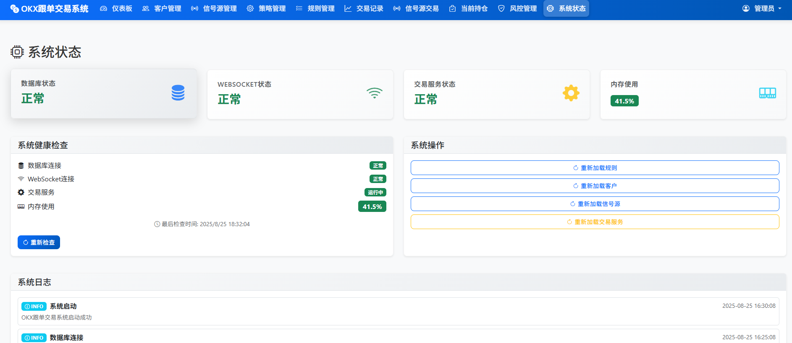

# OKX Copy Trading System - Frontend Management Interface

<div align="center">


**Modern Web Management Console**

[](https://developer.mozilla.org/en-US/docs/Web/HTML)
[](https://developer.mozilla.org/en-US/docs/Web/CSS)
[](https://developer.mozilla.org/en-US/docs/Web/JavaScript)
[](https://getbootstrap.com/)
[](https://www.chartjs.org/)

**Language**: [🇨🇳 中文](./README.md) | 🇺🇸 English

</div>

## 📋 Table of Contents

- [🎯 Interface Overview](#-interface-overview)
- [🏗️ Page Structure](#️-page-structure)
- [📊 Feature Modules](#-feature-modules)
- [🛠️ Technical Implementation](#️-technical-implementation)
- [📱 Interface Preview](#-interface-preview)
- [📖 Operation Guide](#-operation-guide)
- [⚙️ Configuration Instructions](#️-configuration-instructions)
- [❓ FAQ](#-faq)
- [🔧 Development Guide](#-development-guide)
- [📞 Technical Support](#-technical-support)

## 🎯 Interface Overview

The frontend management interface is the core user interface of the OKX copy trading system, providing an intuitive, modern Web management console. The interface adopts responsive design, supporting desktop, tablet and mobile access, providing users with complete trading management functions.

### ✨ Core Features

- 🎨 **Modern Design**: Using Bootstrap 5 framework with beautiful and modern interface
- 📱 **Responsive Layout**: Perfect adaptation to different screen sizes
- ⚡ **Real-time Updates**: Automatic background refresh with real-time data synchronization
- 🔐 **Secure Authentication**: Complete user authentication and permission management
- 📊 **Data Visualization**: Rich charts and statistical information display
- 🚀 **High Performance**: Optimized code structure and loading mechanisms
- 🔄 **Auto Refresh**: Intelligent background data update mechanism
- 🎯 **User-friendly**: Intuitive operation interface and interaction experience

## 🏗️ Page Structure

### File Structure

```
frontend/
├── 📄 index.html          # Main management interface
├── 📄 login.html          # Login page
├── 📄 app.js              # Main JavaScript logic
├── 📄 styles.css          # Custom styles
├── 📄 config.js           # Frontend configuration file
├── 📄 README_EN.md        # Frontend documentation (English)
├── 📄 README.md           # Frontend documentation (Chinese)
└── 📁 img/                # Image resources
    ├── logo.png           # System Logo
    ├── dashboard.png      # Dashboard preview
    └── interface.png      # Interface preview
```

### Page Layout

#### Main Interface Layout
```

```

#### Responsive Design
- **Desktop (≥1200px)**: Fixed sidebar, adaptive main content area
- **Tablet (768px-1199px)**: Collapsible sidebar, main content area dominates
- **Mobile (<768px)**: Hidden sidebar, full-screen main content area

## 📊 Feature Modules

### 🏠 Dashboard

**Feature Description**: System overview and key metrics display

**Main Features**:
- 📈 Real-time statistical data display
- 📊 Chart visualization display
- 🔄 Automatic data refresh
- 📱 Responsive layout adaptation
- 🎯 Key metrics monitoring

**Interface Elements**:
- Statistics cards (total customers, today's trades, active strategies, system status)
- Chart areas (trading trends, profit analysis)
- Recent activity list
- Quick action buttons
- System status indicators

### 👥 Client Management

**Feature Description**: Client account information management and monitoring

**Main Features**:
- 🔍 Client information search and filtering
- 📊 Client asset status monitoring
- 📈 Trading history queries
- ⚙️ Client permission configuration
- 💰 Asset information management

**Interface Elements**:
- Client list table
- Search and filter forms
- Client details popup
- Action buttons (edit, delete, view details)
- Asset information display

### 📡 Signal Source Management

**Feature Description**: Signal source configuration and status monitoring

**Main Features**:
- 📡 Signal source status monitoring
- ⚙️ Signal source configuration management
- 📊 Signal source performance analysis
- 🔄 Real-time data synchronization
- 📈 Historical data viewing

### 📊 Strategy Management

**Feature Description**: Trading strategy configuration and management

**Main Features**:
- 📋 Strategy list management
- ⚙️ Strategy parameter configuration
- 📈 Strategy performance analysis
- 🔄 Strategy status monitoring
- 📊 Strategy statistics

### 📈 Trading Records

**Feature Description**: Trading history record queries and analysis

**Main Features**:
- 📋 Trading record list
- 🔍 Advanced search functionality
- 📊 Trading statistical analysis
- 📈 Chart visualization
- 📄 Data export functionality

## 🛠️ Technical Implementation

### Frontend Technology Stack

#### Core Technologies
- **HTML5**: Semantic markup language
- **CSS3**: Modern stylesheet
- **JavaScript ES6+**: Modern JavaScript features
- **Bootstrap 5**: Responsive UI framework

#### Data Visualization
- **Chart.js**: Chart library
- **Canvas API**: Custom chart drawing
- **SVG**: Vector graphics support

#### Network Communication
- **Fetch API**: Modern HTTP requests
- **WebSocket**: Real-time data push
- **AJAX**: Asynchronous data loading

## 📱 Interface Preview

### 🖥️ System Main Interface

<div align="center">

#### 📊 System Dashboard
*Real-time data monitoring, key indicators at a glance*


#### ⚙️ Strategy Management Center
*Intuitive strategy configuration interface supporting complex rule settings*


#### 📈 Position Monitoring Panel
*Real-time position status with intelligent risk alerts*


</div>

### 📱 Mobile Adaptation

<div align="center">

#### Mobile Responsive Design
*Perfect adaptation to various screen sizes with touch operation optimization*


#### Trading Operation Interface
*Professional trading tools with simplified mobile operations*


#### Feature Showcase
*Core feature modules and overall interface layout*



</div>

### 🎨 Interface Features

#### Design Highlights
- 🎨 **Modern Design**: Adopting latest Material Design language
- 📊 **Data Visualization**: Chart.js chart library with rich visualization effects
- 🎯 **Interaction Optimization**: Smooth animation effects and user feedback
- 🌈 **Theme Support**: Support for light/dark theme switching

#### User Experience
- 📱 **Perfect Adaptation**: Support for all mainstream devices and browsers
- ⚡ **Fast Response**: Optimized loading speed and interaction performance
- 🔍 **Smart Search**: Real-time search and filtering functions
- 📋 **Batch Operations**: Support for multi-selection and batch processing

#### Technical Features
- 🚀 **Progressive Loading**: On-demand loading to improve page performance
- 🔄 **Real-time Updates**: WebSocket real-time data push
- 💾 **Local Caching**: Intelligent caching strategy to reduce network requests
- 🛡️ **Security Protection**: XSS protection and secure data processing

## 📖 Operation Guide

### Quick Start

#### 1. Access System
1. Open browser and visit system address
2. Enter username and password to login
3. Enter main management interface

#### 2. Navigation Operations
- **Sidebar Navigation**: Click left menu to switch function modules
- **Breadcrumb Navigation**: View current location and quick return
- **Search Function**: Use top search box for quick search

#### 3. Data Operations
- **View Data**: Click list items to view detailed information
- **Edit Data**: Click edit button to modify information
- **Delete Data**: Click delete button to remove records
- **Export Data**: Use export function to download data

### Feature Operation Details

#### Dashboard Usage
1. **View Statistics**: Browse statistics cards to understand system status
2. **Analyze Chart Data**: View charts to understand trend changes
3. **Monitor System Status**: Pay attention to system health status indicators
4. **Quick Operations**: Use shortcut buttons to execute common operations

#### Client Management Operations
1. **Add Client**: Click "Add Client" button to create new client
2. **Edit Client**: Click edit button in client list
3. **View Details**: Click client name to view detailed information
4. **Search Filter**: Use search box and filter conditions to find clients

### Keyboard Shortcuts
- `Ctrl + F`: Quick search
- `Ctrl + R`: Refresh data
- `Ctrl + S`: Save settings
- `Esc`: Close popup
- `F5`: Refresh page

## ⚙️ Configuration Instructions

### Frontend Configuration

#### Configuration File (config.js)
```javascript
const CONFIG = {
    // API configuration
    API_BASE_URL: '/api/v1',
    API_TIMEOUT: 30000,
    
    // Auto refresh configuration
    AUTO_REFRESH_INTERVAL: 30000,
    AUTO_REFRESH_ENABLED: true,
    
    // Chart configuration
    CHART_COLORS: ['#007bff', '#28a745', '#ffc107', '#dc3545'],
    CHART_ANIMATION: true,
    
    // Pagination configuration
    PAGE_SIZE: 20,
    MAX_PAGE_SIZE: 100,
    
    // Theme configuration
    THEME: 'light',
    LANGUAGE: 'en-US'
};
```

### Browser Compatibility

#### Supported Browsers
- **Chrome**: 80+
- **Firefox**: 75+
- **Safari**: 13+
- **Edge**: 80+

#### Feature Support
- **ES6+**: Modern JavaScript features
- **CSS Grid**: Modern layout system
- **Flexbox**: Flexible layout
- **Fetch API**: Modern HTTP requests
- **LocalStorage**: Local storage

## ❓ FAQ

### Interface Display Issues

#### Q: Page display is abnormal, what to do?
**A**: Please check the following items:
1. Ensure browser version is supported
2. Clear browser cache
3. Check network connection
4. Refresh page and retry

#### Q: Charts not displaying, what to do?
**A**: Possible solutions:
1. Check if JavaScript is enabled
2. Confirm Chart.js library is loaded
3. Check if data format is correct
4. View browser console error messages

### Performance Optimization Issues

#### Q: Page loading is slow?
**A**: Optimization suggestions:
1. Enable browser caching
2. Compress static resources
3. Use CDN acceleration
4. Optimize image sizes

## 🔧 Development Guide

### Development Environment Setup

#### 1. Environment Requirements
```bash
# Node.js version
node >= 14.0.0
npm >= 6.0.0

# Browser requirements
Chrome >= 80
Firefox >= 75
Safari >= 13
```

#### 2. Development Tools
```bash
# Code editors
VS Code (recommended)
Sublime Text
WebStorm

# Browser development tools
Chrome DevTools
Firefox Developer Tools
Safari Web Inspector
```

### Code Standards

#### JavaScript Standards
```javascript
// Use ES6+ syntax
const apiClient = new APIClient();

// Use async/await
async function fetchData() {
    try {
        const response = await apiClient.get('/data');
        return response.data;
    } catch (error) {
        console.error('Failed to fetch data:', error);
        throw error;
    }
}

// Use arrow functions
const handleClick = (event) => {
    event.preventDefault();
    // Handle click event
};
```

## 📞 Technical Support

### Contact Information

- **Project Address**: [GitHub Repository](https://github.com/hall130/crypto_trade_for_public)
- **Issue Feedback**: [Issues Page](https://github.com/hall130/crypto_trade_for_public/issues)
- **Documentation Updates**: [Wiki Page](https://github.com/hall130/crypto_trade_for_public/wiki)
- **Email Support**: saylas163@gmail.com

### Update Log

#### v1.2.0 (2024-01-15)
- ✨ Added auto refresh functionality
- 🎨 Interface design optimization
- 📱 Mobile adaptation improvements
- ⚡ Performance optimization improvements
- 🐛 Fixed known issues
- 🌐 Added English version documentation

---

## 🔗 Related Documents

- [📋 Installation Guide](../docs/INSTALLATION_EN.md) - System installation and configuration
- [📖 User Manual](../docs/USER_GUIDE_EN.md) - Complete operation guide
- [🏗️ System Architecture](../docs/ARCHITECTURE_EN.md) - Technical architecture details
- [🔌 API Documentation](../docs/API_REFERENCE_EN.md) - Interface reference documentation
- [📝 Changelog](../docs/CHANGELOG_EN.md) - Version update records

### 🧭 Quick Navigation

- [⬆️ Back to Main Documentation](../README_EN.md#-documentation)
- [🚀 Quick Start](../README_EN.md#-quick-start)
- [💡 Features](../README_EN.md#-features)
- [📞 Technical Support](../README_EN.md#-technical-support)

---

<div align="center">

**If this project helps you, please give it a ⭐️!**

Made with ❤️ by [sylas]

</div> 